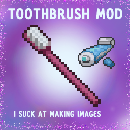

<h1 align="center">
  
   
  AoqiaToothbrushMod
</h1>

This is a toothbrush mod and it's completely open-source. 
The idea was from "Madman's Toothpase Emporium" which hasn't been updated in quite some time.

## Details

-   Needs at least a toothbrush to work! Toothpaste is optional and will double the speed of brushing.
-   Brush your teeth to reduce unhappyness (`-10` only twice a day)! Toothpaste speeds up this process by `2x`.
-   If you don't brush your teeth at least once a day, you will accumulate an unhappyness buff every day.
-   Brushing your teeth for the full amount (default 2 brushes) for (default 10 days) will give you the Golden Brusher trait! This means you only have to brush your teeth half as much!!!
-   On the flip side, not brushing your teeth at least once for (default 7 days) will give you the Foul Brusher trait. This means you have to brush twice as frequently.
-   The toothbrush moodle will show you how clean your teeth are. This is a direct representation of how much you need to brush your teeth. super dirty means you need to brush your teeth if you care and super clean means you have gained all the benefits of brushing your teeth (and only need to brush more for roleplaying purposes.)
-   I will add more here when I can think.

To visualise the daily effect formula, I have created simple desmos graph: https://www.desmos.com/calculator/awdp9rmxs8
If you intend to change the exponent value in the Sandbox Options, you should change it in the graph first so you can see how it affects the game.

You can view the documentation for the sandbox options in the wiki/[SANDBOX_OPTIONS.md](SANDBOX_OPTIONS.md)

## GitHub Projects

-   Bug and Feature Tracker: https://github.com/users/aoqia194/projects/5
